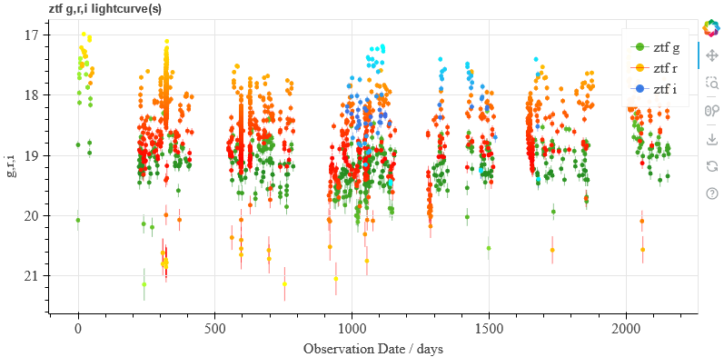
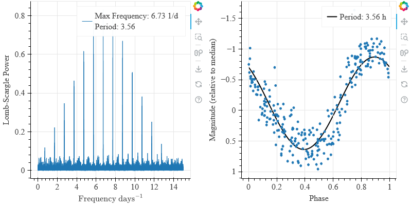
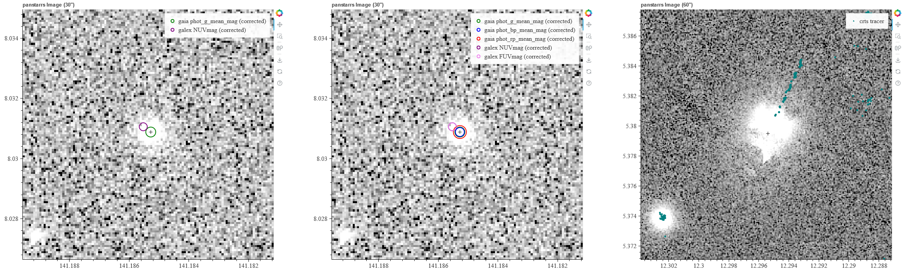
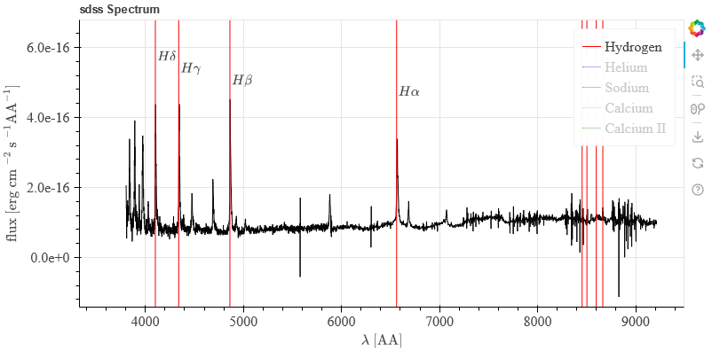
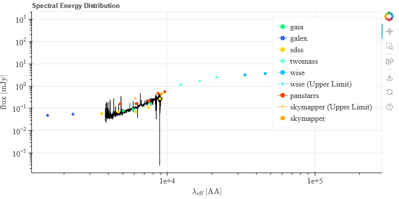
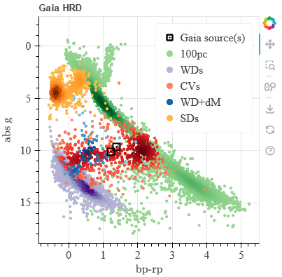
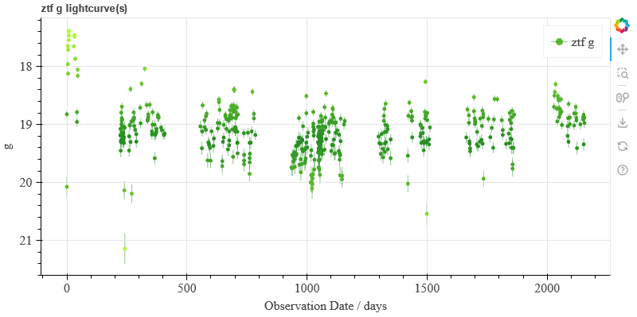
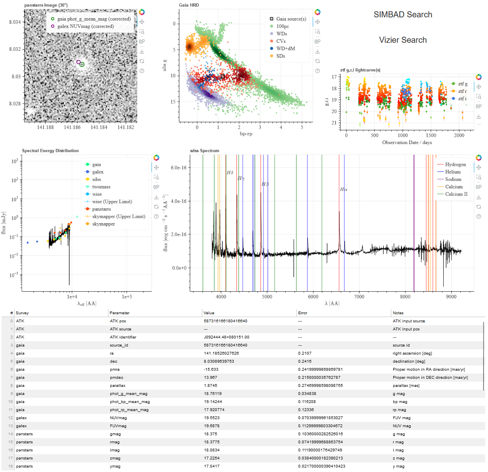

Examples
========

Data Queries
------------

.. code-block:: python

    from AstroToolkit.Tools import query

    # specify a Gaia source
    source = 587316166180416640

    # retrieve GALEX data, no radius is given so this will be taken from the config.
    galex_data = query(kind="data", source=source, survey="galex")

    # output this data to the terminal in a readable format
    galex_data.showdata()

    # retrieve Gaia data, this time supplying a radius - overriding the config value.
    gaia_data = query(kind="data", source=source, survey="gaia", radius=5)

    # grab the parallax from Gaia
    parallax = gaia_data.data["parallax"][0]

    # retrieve WISE photometry
    wise_phot = query(kind="phot", source=source, survey="wise")

    # retrieve all available photometry
    bulkphot = query(kind="bulkphot", source=source)

    # grab the panstarrs and skymapper photometry from bulkphot
    panstarrs_phot = bulkphot.data["panstarrs"]
    skymapper_phot = bulkphot.data["skymapper"]

|

Lightcurve Fetching and Plotting
--------------------------------

.. code-block:: python

    from AstroToolkit.Tools import query

    # specify a Gaia source
    source = 587316166180416640

    # retrieve ZTF light curve data and plot it, specifying the colours for each band.
    # No radius  is given, so this will be taken from the config.
    figure = query(kind="lightcurve", source=source, survey="ztf").plot(
        colours=["green", "red", "blue"]
    )

    # show the lightcurves in the browser (and save to a static .html file)
    figure.showplot()

**Note:** This example can be loaded from within the package using:

.. code-block:: python
    
    from AstroToolkit.Examples import lightcurve

|

Timeseries Plotting
-------------------

.. code-block:: python
    
    from AstroToolkit.Tools import query

    # specify a Gaia source
    source = 6050296829033196032

    # retrieve ztf data for our Gaia source, plot it as a power spectrum, and then show it.
    power_spectrum = (
        query(kind="lightcurve", source=source, survey="ztf")
        .plot(kind="powspec")
        .showplot()
    )

    # retrieve ztf data for our Gaia source, phase fold it, and then show it.
    phase_fold = (
        query(kind="lightcurve", source=source, survey="ztf").plot(kind="phase").showplot()
    )

**Note:** This example can be loaded from within the package using:

.. code-block:: python

    from AstroToolkit.Examples import timeseries

|

Image Fetching and Plotting
---------------------------

.. code-block:: python
    
    from AstroToolkit.Tools import query

    # specify a Gaia source
    source = 587316166180416640

    """ 
    Retrieve any available image and plot it.
    No size or band is given, so these will be taken from the config. 
    Since overlays is given as a list, only the magnitude listed for each survey in the config
    will be overlayed as a detection (in this case, phot_g_mean_mag for gaia, and NUVmag for GALEX)
    """
    figure = query(
        kind="image", source=source, survey="any", overlays=["gaia", "galex"]
    ).plot()

    # show the image in the browser (and save to a static .html file)
    figure.showplot()

    # Now, give overlays as a dict containing all magnitudes to overlay.
    figure_allmags = query(
        kind="image",
        source=source,
        survey="any",
        overlays={
            "gaia": ["phot_g_mean_mag", "phot_bp_mean_mag", "phot_rp_mean_mag"],
            "galex": ["NUVmag", "FUVmag"],
        },
    ).plot()

    # show the image in the browser (and save to a static .html file)
    figure_allmags.showplot()

    """
    Now, include a light curve survey as an overlay. For surveys with enough positional
    precision, this can be used to trace the motion of the object through time.
    We have also specified an image size, which will override the value in the config.
    A different gaia source with a large proper motion has been used.
    """
    figure_tracer = query(
        kind="image",
        source=2552928187080872832,
        survey="panstarrs",
        overlays=["crts"],
        size=60,
    ).plot()

    figure_tracer.showplot() 

**Note:** This example can be loaded from within the package using:

.. code-block:: python

    from AstroToolkit.Examples import image

|

Spectrum Fetching and Plotting
------------------------------

.. code-block:: python

    from AstroToolkit.Tools import query

    # specify a Gaia source
    source = 587316166180416640

    # retrieve an SDSS spectrum for the gaia source, plot it and then show it.
    # As no radius is given, this will be taken from the config.
    spectrum = query(kind="spectrum", source=source, survey="sdss").plot().showplot()

**Note:** This example can be loaded from within the package using:

.. code-block:: python

    from AstroToolkit.Examples import spectrum

|

SED Fetching and Plotting
-------------------------

.. code-block:: python

    from AstroToolkit.Tools import query

    # specify a Gaia source
    source = 587316166180416640

    # retrieve and plot an sed, with an overlayed SDSS spectrum.
    sed = query(kind="sed", source=source).plot(spectrum_overlay=True, survey="sdss")

    # show the figure in the browser (and save to a static .html file)
    sed.showplot()

**Note:** This example can be loaded from within the package using:

.. code-block:: python

    from AstroToolkit.Examples import sed

|

HRD Fetching and Plotting
-------------------------

.. code-block:: python

    from AstroToolkit.Tools import query

    # specify a Gaia source
    source1 = 587316166180416640

    # Specify a second Gaia source. This is not necessary - any number of sources can be overlayed.
    source2 = 6050296829033196032

    # retrieve Gaia hrd data for our list of sources, plot it and then show it.
    hrd = query(kind="hrd", sources=[source1, source2]).plot().showplot()

**Note:** This example can be loaded from within the package using:

.. code-block:: python
    
    from AstroToolkit.Examples import hrd

|

Local Files Saving and Reading
------------------------------

.. code-block:: python

    from AstroToolkit.Tools import query, readdata

    # specify a Gaia source
    source = 587316166180416640

    # retrieve ZTF light curve data for our source and save this structure to a local file
    filename = query(kind="lightcurve", source=source, survey="ztf").savedata()

    # recreate the original data structure from the local file
    recreated_data = readdata(filename)

    # plot only the g band of this data in the colour green, and show it.
    recreated_data.plot(colours=["green"], bands=["g"]).showplot()

**Note:** This example can be loaded from within the package using:

.. code-block:: python
    
    from AstroToolkit.Examples import localfiles

|

Datapage Creation
-----------------

.. code-block:: python

    from bokeh.layouts import column, layout, row
    from bokeh.plotting import output_file, show

    from AstroToolkit.Datapages import buttons, datatable, gridsetup
    from AstroToolkit.Tools import query

    # source = Hu Leo
    source = 587316166180416640

    # set grid size (scales size of datapage)
    grid_size = 250

    # get image data and plot it
    image = query(
        kind="image", survey="any", source=source, overlays=["gaia", "galex"]
    ).plot()

    # get hrd data and plot it
    hrd = query(kind="hrd", sources=source).plot()

    # get sed data and plot it
    sed = query(kind="sed", source=source).plot(spectrum_overlay=True, survey="sdss")

    # get spectrum data and plot it
    spectrum = query(kind="spectrum", survey="sdss", source=source).plot()

    # get lightcurve data [g,r,i] and plot it
    lightcurves = query(kind="lightcurve", survey="ztf", source=source).plot(
        colours=["green", "red", "blue"]
    )

    # get SIMBAD and Vizier buttons
    buttons = buttons(source=source, grid_size=grid_size)

    # get a metadata table with default parameters for various surveys
    metadata = datatable(
        source=source,
        selection={
            "gaia": "default",
            "galex": "default",
            "panstarrs": "default",
            "skymapper": "default",
            "sdss": "default",
            "wise": "default",
            "twomass": "default",
        },
    )

    # formats plots for use in grid
    grid_plots = gridsetup(
        dimensions={"width": 6, "height": 6},
        plots=[
            {"name": "image", "figure": image, "width": 2, "height": 2},
            {"name": "hrd", "figure": hrd, "width": 2, "height": 2},
            {"name": "sed", "figure": sed, "width": 2, "height": 2},
            {"name": "lightcurves", "figure": lightcurves, "width": 2, "height": 1},
            {"name": "buttons", "figure": buttons, "width": 2, "height": 1},
            {"name": "spectrum", "figure": spectrum, "width": 4, "height": 2},
            {"name": "metadata_table", "figure": metadata, "width": 6, "height": 2},
        ],
        grid_size=grid_size,
    )

    # set up the final grid
    datapage = layout(
        column(
            row(
                grid_plots["image"],
                grid_plots["hrd"],
                column(grid_plots["buttons"], grid_plots["lightcurves"]),
            ),
            row(grid_plots["sed"], grid_plots["spectrum"]),
            row(grid_plots["metadata_table"]),
        )
    )

    # give output file a name
    output_file(f"{source}_datapage.html")

    # show the datapage (also saves it)
    show(datapage)

**Note:** This example can be loaded from within the package using:

.. code-block:: python

    from AstroToolkit.Examples import datapage

|

PyAOV Time Series Analysis
--------------------------

.. code-block:: python

    from AstroToolkit.Tools import query, tsanalysis

    # perform PyAOV time series analysis on a light curve data structure
    tsanalysis(query(kind="lightcurve", source=6050296829033196032, survey="ztf"))

**Note:** This example can be loaded from within the package using:

.. code-block:: python
    
    from AstroToolkit.Examples import pyaov
