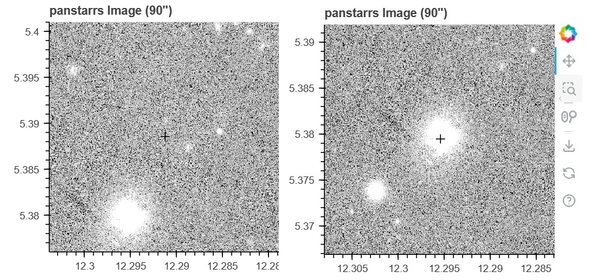

.. AstroToolkit documentation master file, created by
   sphinx-quickstart on Tue Aug 13 00:12:35 2024.
   You can adapt this file completely to your liking, but it should at least
   contain the root `toctree` directive.

AstroToolkit Documentation
==========================

AstroToolkit (ATK) is a set of tools for fetching, plotting, and analysing astronomical data. The package is in active development, so please report any issues/suggestions/contributions to its `GitHub repository <https://github.com/WD-planets/AstroToolkit>`_.

|

Features
--------
- A GUI through which most of the package can be utilised
- Command-line integration
- Scripting integration for greater control
- Proper motion correction through Gaia, utilised across the entire package
- Light curve, spectral energy distribution, spectrum and image queries from a wide range of surveys
- Gaia HRD queries for any Gaia sources
- In-built interactive plotting support for all of the above as shareable .html pages that retain all interactivity
- Data queries from any `Vizier <https://vizier.cds.unistra.fr/>`_ survey, with many commonly used surveys built-in
- Reddening queries from `Stilism  <https://stilism.obspm.fr/>`_ and `GDRE <https://irsa.ipac.caltech.edu/applications/DUST/>`_
- Data analysis tools:
    
    - Timeseries analysis using a variety of methods (Lomb-Scargle, AOVMHW, ...)
    - Light curve binning, clipping, phase folding and sigma-clipping
    - Image detection and tracer overlays
    - Spectral band highlighting
    - SED-spectrum overlays
    - Data quality filtering (optional)

- Lossless saving and reading of any ATK data structures to / from local files
- Datapage creation, allowing the combination of any of the above into a single page with additional elements specifically designed for this purpose
- No hard coded parameters - built-in configuration support allows the user to personalise the package to their specific needs.
- All data structures are available to the user, allowing them to use all ATK routines on non-ATK data
- Other quality-of-life tools, such as coordinate conversions, .fits file reading and `Vizier <https://vizier.cds.unistra.fr/>`_ / `SIMBAD <https://simbad.u-strasbg.fr/simbad/>`_ searches

|

Acknowledgements
----------------
I would like to give thanks to Dr. Keith Inight for his guidance at various stages of the package's development, and particularly for his help in integrating the PyAOV time series analysis routines.

I would also like to give thanks to Prof. Boris Gänsicke for his assistance and guidance, and for supporting the package's development.

|

Installation
------------

The package can be installed like any other package, e.g. using pip:

.. code-block:: python

    pip install AstroToolkit

This package also includes the PyAOV time series analysis routines by `A. Schwarzenberg-Czerny <https://users.camk.edu.pl/alex/#software>`_, which may require additional dependencies. See :ref:`Setup` for details.

|

Introduction
------------

ATK uses `Bokeh <https://bokeh.org/>`_ as its primary plotting library. A key property of Bokeh plots is that they can be saved as static .html files, which can then be shared/accessed while retaining all interactivity.

Across ATK, there are two possible ways to target your system of interest:
1. pos = [right ascension,declination] in degrees
2. source = Gaia Source ID

Where possible, it is usually best to use a Gaia source as input, as this enables a key feature of ATK: **Proper Motion Correction**.

A good example of this is in imaging queries. If a 'pos' is used as input, the result will simply be the image data returned by the chosen imaging survey at those exact coordinates. However, this may not be ideal in the case of an object with a large proper motion. If a source is used instead, the data returned will have accounted for this, resulting in the image being centered on the target system. This concept is used throughout ATK when matching data from different surveys to a given system.

|

.. toctree::
   :maxdepth: 2
   :caption: Contents:

   modules 

   datastructures

   configkeys

   commandline

   examples
